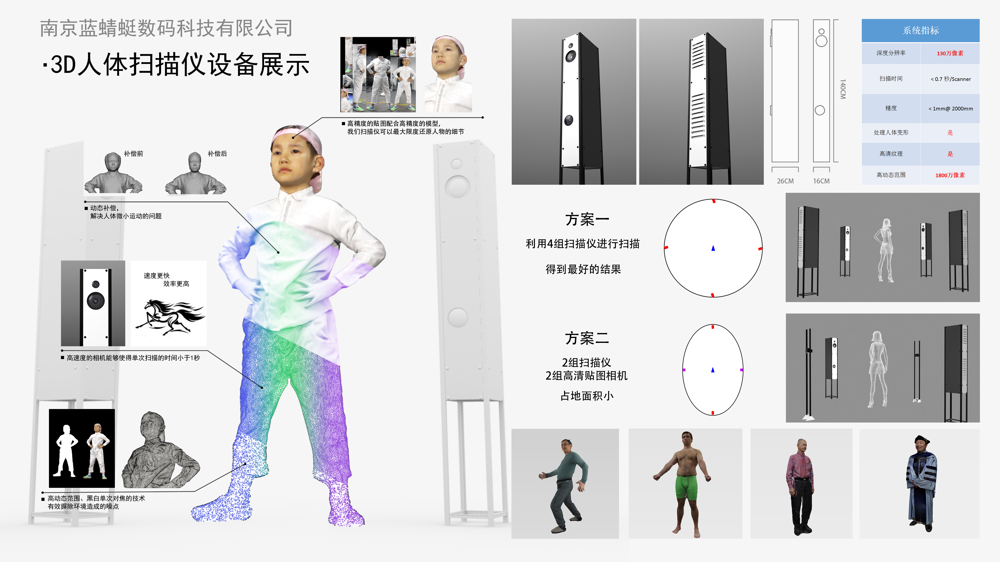
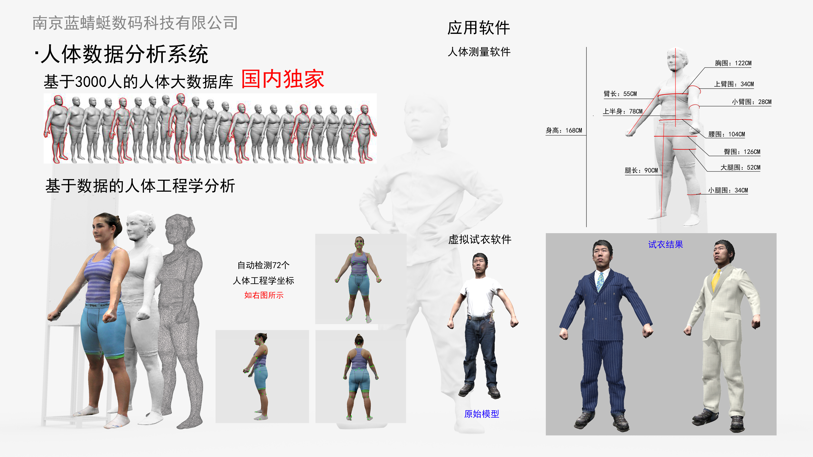
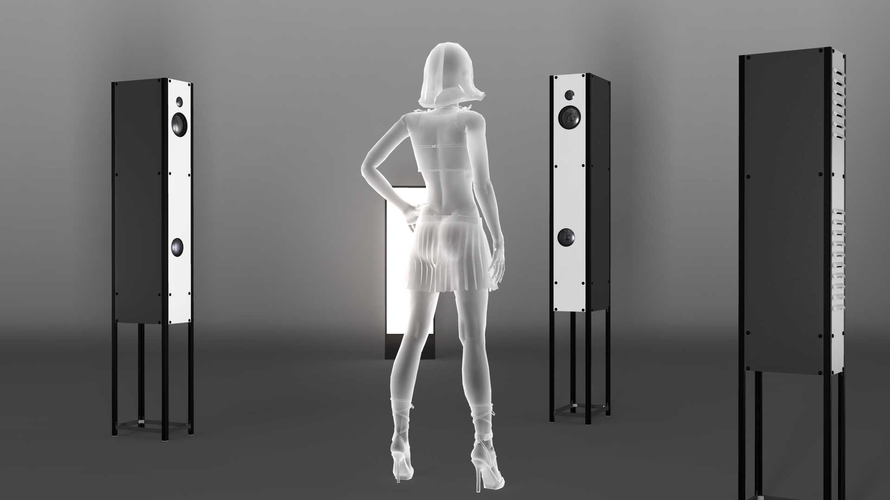

公司自有的人体扫描系统，是一个快速便捷的人体扫描工具：受试者只需站在扫描系统中间，经过一次不到 10 秒的快速扫描，算法会立即生成人体模型，受试者在 3 分钟内就能看到结果。

我们把该系统应用于虚拟试穿（virtual try-on）与虚拟量体（virtual measurement）。

## 我的工作

我负责制作虚拟服装并把服装穿到扫描出的模型上。经过多次测试与流程迭代，最终把我负责的全部工作整合进了扫描系统。

