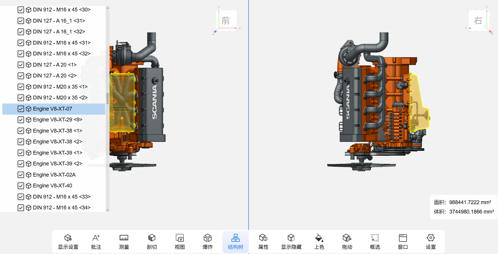

我于2023年8月加入新迪，负责新迪轻量化引擎项目中，核心的渲染模块的功能拓展与开发。并深度参与了数据轻量化之后的数据准确性的验证。确保了数据在渲染过程中的准确性和稳定性。

## 项目演示

产品官网：<a href="https://www.3dopen.cn/product/product01.html" target="_blank" rel="noopener">新迪轻量化引擎 · 3DOpen</a>

## 我的工作

负责轻量化引擎核心功能模块、CAD 插件与几何算法开发（C++ / JavaScript / WebGL）。

在渲染方向，主导重构了轻量化引擎的渲染效率，优化 10 万+节点、10 亿离散三角面级别的模型在 Web 端的渲染性能，达到 30fps 以上；同时完善了 CAD 剖切功能，对剖切轮廓进行分类与特征提取（弧、圆等）并添加特征测量能力；还设计并实现了多视口核心模块，支持从不同视角观察模型并处理相应的用户输入事件，并利用后处理 pass 优化选中模型的勾边高亮效果。

在几何算法方向，主导设计了模型干涉检查的全流程，参与空间加速与干涉状态回显等核心流程的开发；基于 Creo 二开框架，主导设计并开发了 CAD 数据对比工具的全部流程，包括中间数据结构与获取流程管理、对比线程管理，以及差异报告（截图+差异日志）的输出。

此外，担任广东省铸魂工程模型轻量化引擎三期攻关项目的项目经理，对内负责主要功能点的研发排期，对外协调软件集成方与最终用户方的问题修复、功能演示与进度对齐。
