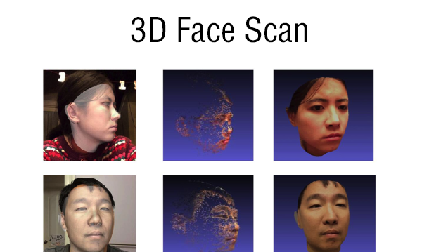
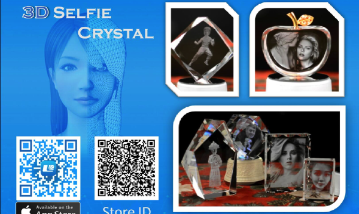
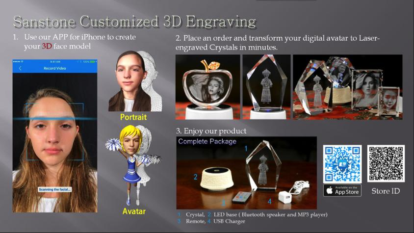

一个商业项目，用于销售定制化水晶内雕（crystal internal sculpture）。用户可以用这款 App 建模自己的 3D 虚拟人脸，然后把模型发送给我们制作水晶内雕。

用户完成建模流程后，服务器会生成其人脸模型，可以将人脸模型与我们预设的模板合并，或保留原始模型做成半身像。如果用户想购买水晶雕像，我们会以该模型作为激光水晶雕刻设备的输入数据，雕刻完成后再把成品寄给用户。

## 我的工作

主要负责建模与改进现有模型模板（主要使用 Maya 和 MeshLab），同时编写 Maya 的 Python 脚本提升整体工作效率。

