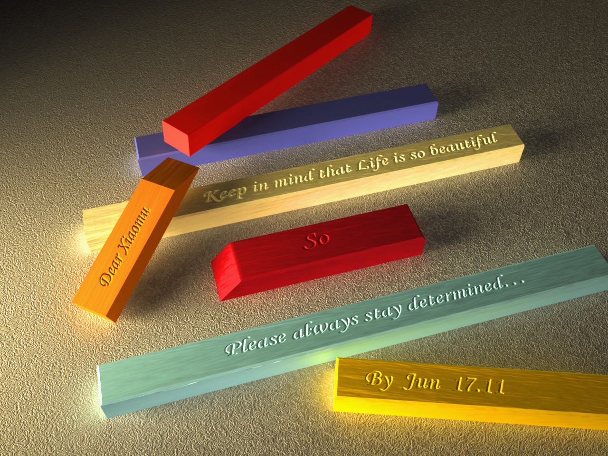
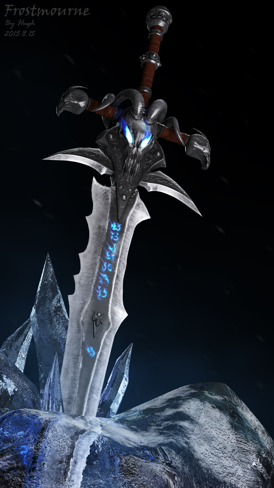
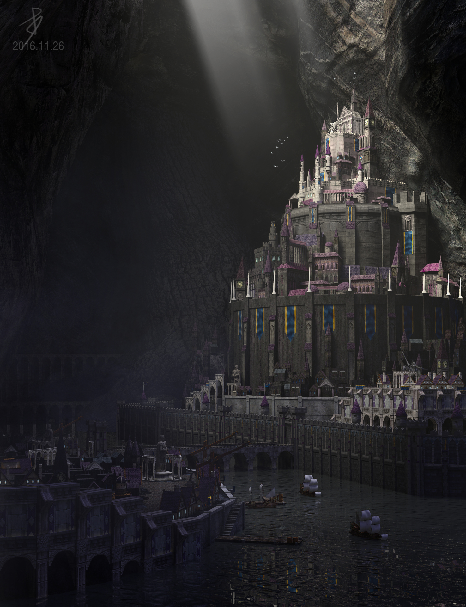
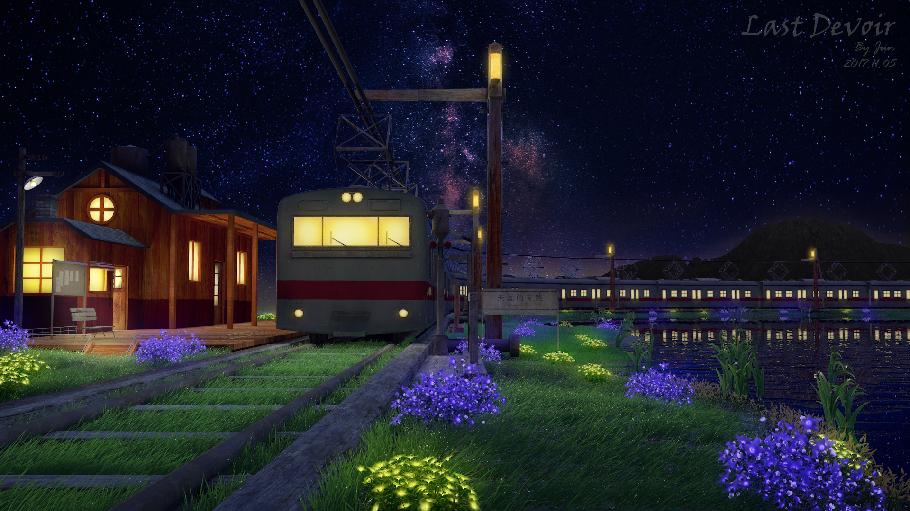
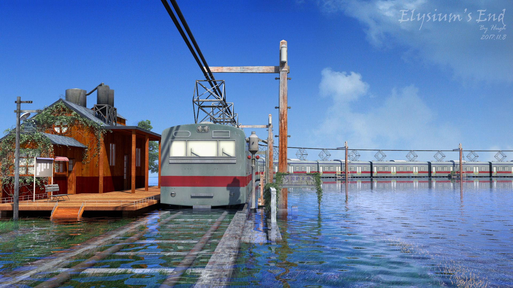
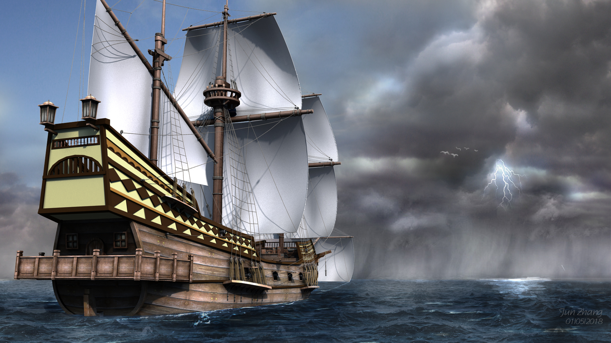
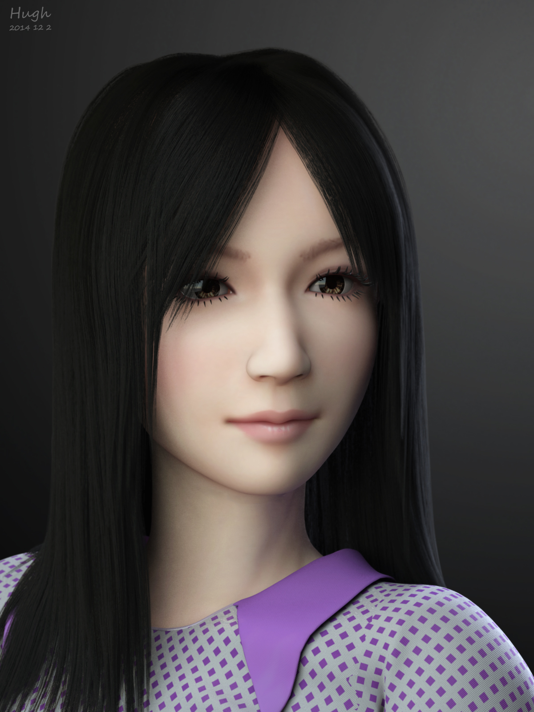
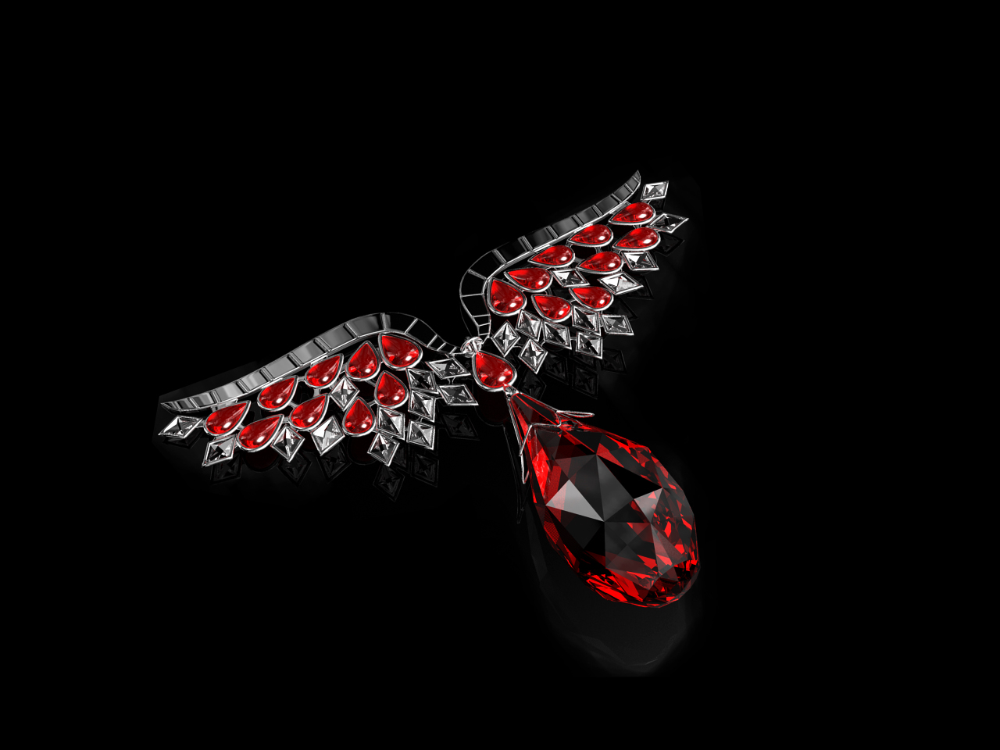
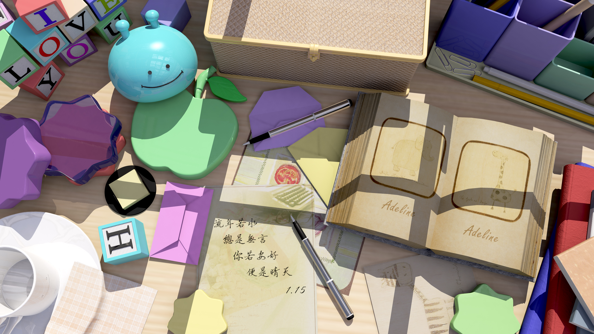
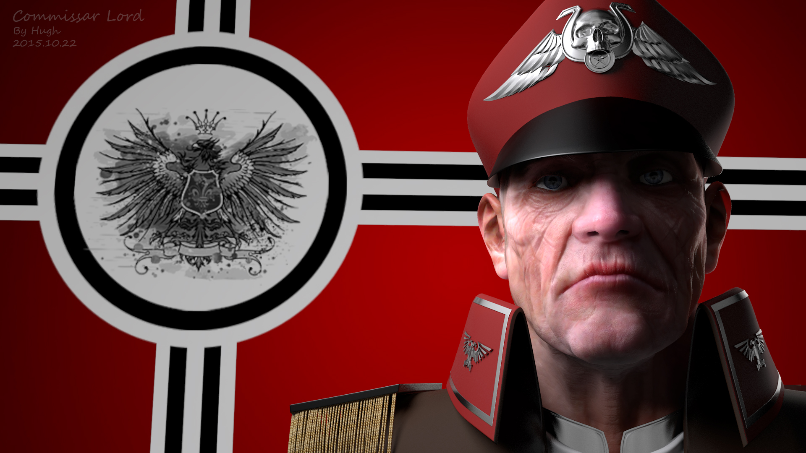

以下所有作品均由我本人独立完成——从最初的概念设计到最终成图。挑选这些作品，主要是为了展示我在数字美术方面的能力。

## Anniversary（周年）

这张图是我初到美国时创作来激励自己的。我选择了简洁的几何体，并把美好的祝愿"刻"在上面。虽然几何体相对简单，但配合出色的光效与细节丰富的地毯背景，画面呈现出和谐而美妙的视觉效果。生活是美好的，请保持坚定！

*尺寸：1280 × 960 ｜ 渲染器：MentalRay*

## Frostmourne（霜之哀伤）

正如画面所展示的，这张图是为了致敬暴雪的著名游戏《魔兽世界》。我非常喜欢这把剑，也为阿尔萨斯的悲剧命运感到惋惜。

我在 Maya 中制作低模，并在 ZBrush 中雕刻这把剑；高模完成后，在 ZBrush 中烘焙法线贴图和置换贴图，在 Maya 中烘焙 AO 贴图，然后在 Photoshop 中绘制全部贴图。除了漫反射贴图，我还制作了高光贴图和反射贴图，以便完全控制高光点位与反射效果。一切就绪后，我从 Maya 输出多个不同的图层（漫反射、反射、高光、AO、遮罩），最终合成这张图。

*尺寸：1080 × 1920 ｜ 渲染器：MentalRay*

## Black Stone（黑石城）

我热爱宏大的建筑，因此创作了这座宏伟的地下城市——黑石城。城市分为三层，我想让顶层成为画面的亮点，于是在图像上方加入了一束丁达尔光（god ray）。它把画面分割成不同部分、让上部脱颖而出，形成了有趣的视觉效果。整座城市的材质只有石头与砖，所以我刻意限制了高光项。

*尺寸：1080 × 1920 ｜ 渲染器：MentalRay*

## Last Devior 与 Elysium's End（旅程双联画）

这两张"双生"作品描绘的是旅程。二十多岁那几年我一直在旅行——无论是为了生活还是探索新的地方，所以我偏爱旅程这个主题，也希望未来能遇见更多有趣的人、看到更美的风景。这次练习中我制作了自己的植物库：用 Maya 笔刷塑造植物形态，再转换为实体三维几何体，并为它们赋予了 MentalRay 材质。

*尺寸：1080 × 1920 ｜ 渲染器：MentalRay*

## Far Harbor（远港）

又一张以旅程为主题的作品。对我来说，海洋意味着勇气与好运，希望有一天能扬帆远航，为自由而活。这张图是我练习后期合成（after effects）的成果。

*尺寸：1080 × 1920 ｜ 渲染器：MentalRay*

## Girl Rendering（少女渲染）

我很少做人像，这是第一次尝试。这张图我特别关注 3S（次表面散射）材质与头发渲染，并采用经典的三点布光：主光来自右前方，一盏补光来自左前方，一盏轮廓光来自右后方——这样的光位能让人物从背景中"站"出来。

*尺寸：1200 × 1600 ｜ 渲染器：MentalRay*

## Ornaments（饰品）

饰品渲染是个大课题。我认为最难的部分在于设计，材质反而相对简单。创作这件作品时，我查阅了大量文章与设计指南。这枚挂坠是翅膀与心形的结合：红宝石、白银与水晶在作品中达到了很好的平衡。

*尺寸：1280 × 960 ｜ 渲染器：MentalRay*

## Sunny Days（晴天）

一次室内日光场景的快速测试。我刻意为画面中所有物体挑选了正午阳光下的光色。可以看到，虽然场景包含很多颜色，但在明亮的阳光下，它们被统一进和谐的氛围里，给人安宁之感。

*尺寸：2560 × 1440 ｜ 渲染器：MentalRay*

## Commissar Lord（政委领主）

另一件人物渲染作品。为了增加细节，我在 ZBrush 中雕刻了高模。与上面的少女相比，这张图更侧重人体细节，角色上应用了置换贴图与法线贴图。

*尺寸：1920 × 1080 ｜ 渲染器：MentalRay*
